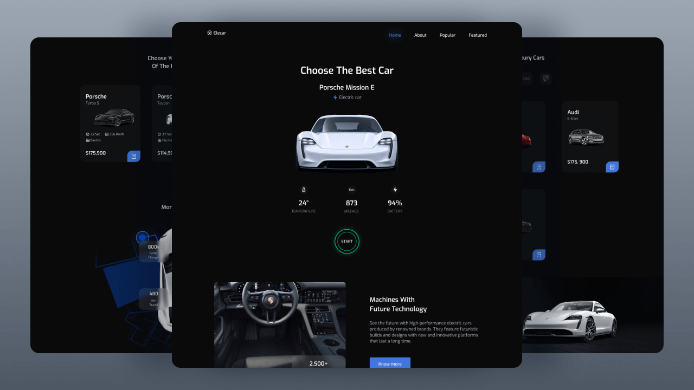

# **`Elecar - Luxury Meets Future Technology`**

For demonstrative purposes.

## **`🔋 What is Elecar ?`**

**Elecar** is an electric luxury car rental website. The customer can choose from a wide range of electric vehicles from prestigious partners such as Tesla or Porsche.



## **`🚀 Challenge`**

1- Integrate the graphic model and components in compliance with W3C standards, SEO and responsive design.

2 - Use external libraries for the use of carousels and filters.

3 - Animate the application with ScrollRevealJS API.

4 - Ensure compatibility on different browsers and devices.

## **`⚙️ Technical approach`**

-   `GulpJS` `Twig` `Sass` `ES6`
-   External : `SwiperJS (Carousel)` `MixItUp (Filters)` `ScrollRevealJS`
-   Mobile First/ Responsive design.
-   Reusable components (buttons, tabs, sections, ... ).
-   SEO friendly.
-   Browsers compatible.

Pieces of the cake :

```twig
<ul  class="featured_filters">
	
		<li  class="featured_item{{ item.is_active  ? ' is-active' : '' }}"  data-filter= {{item.data }}">
			
				<span>{{ item.label }}</span>
			
				
			
		</li>
	
</ul>
```

```javascript
window.addEventListener("DOMContentLoaded", (event) => {
    const menu = document.querySelector(".nav_menu");
    const triggers = document.querySelectorAll(".nav_trigger");

    for (trigger of triggers) {
        trigger.onclick = function () {
            menu.classList.toggle("is-active");
        };
    }
});
```

## **`🔗 Let's Connect`**

> Meet me on Malt : https://www.malt.fr/profile/thomasbarnabe

[](https://www.linkedin.com/in/thomasbarnab%C3%A9/)
